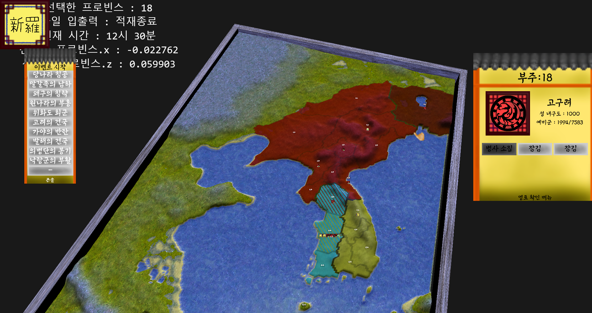

# KoreanHistoryGame-ThreeKings(DirectX12)

삼국시대 게임 입니다.
이전의 [삼국시대 게임](https://github.com/apple01644/KoreanHistoryGame-ThreeKings)을 DirectX12를 사용해서 구현 했습니다.
마우스로 조작 가능합니다.
가운데 마우스 플레이할 국가를 선택 가능합니다.

색깔로 땅의 소유 국가를 알 수 있고 아무 국가도 소유하지 않은 땅은
초원으로 표시 됩니다.
빗금된 땅은 큰 빗금이 소유한 국가이고 
작은 빗금이 실제 지배 하는 국가 입니다.

맵상에 있는 깃발은 하나의 유닛입니다.
국기로 소유 국가를 알 수있고 숫자로 군사의 수를
아이콘으로 현재 행동을 알 수 있습니다.

클릭해서 진행 경로를 알 수 있고 다시 클릭해서 경로를 수정 할 수 있습니다.

## 고마운 분
[d3dcoder](https://github.com/d3dcoder) 
이 분덕에 DirectX를 입문 할 수 있었습니다.
